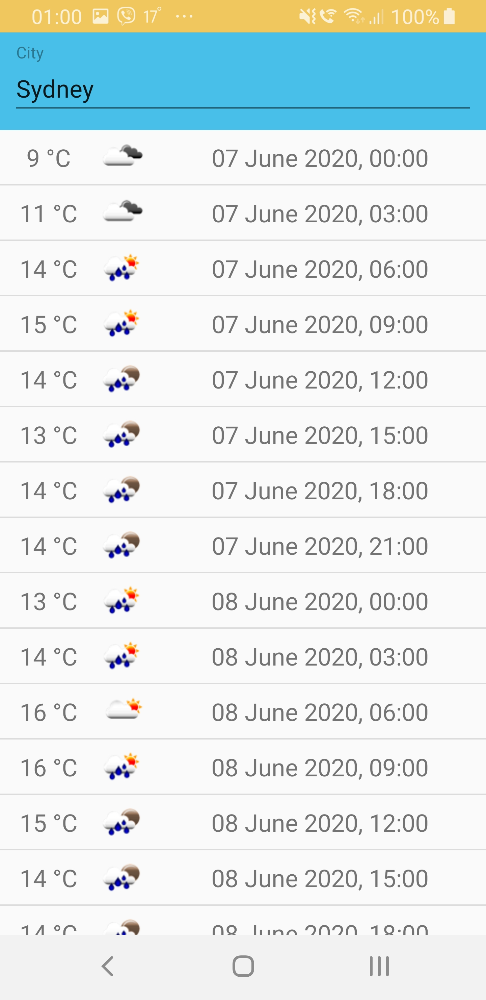

# Open Weather Forecast

Simple Android application which represents a wrapper for [OpenWeatherMap API](https://openweathermap.org/api) and developed mostly to practice with MVVM architectural pattern, LiveData and ViewModel from [Android Architecture Components](https://github.com/googlesamples/android-architecture-components) and Realm database. The application shows 5 day weather forecast for every 3 hours for the city entered in the corresponding field. Also, the application handles configuration changes and implements repository pattern storing cache data locally.



## Dependencies

* [Kotlin](https://github.com/JetBrains/kotlin) 1.3.72
* [Koin](https://github.com/InsertKoinIO/koin) 2.0.1
* [Retrofit](https://github.com/square/retrofit) 2.9.0
* [OkHttp](https://github.com/square/okhttp) 4.7.2
* [RxJava](https://github.com/ReactiveX/RxJava) 2.2.19
* [Groupie](https://github.com/lisawray/groupie) 2.8.0
* [Glide](https://github.com/bumptech/glide) 4.11.0
* [Realm](https://github.com/realm/realm-java) 7.0.0

## Building

Put your API key with the pattern 'apikey="YOUR_API_KEY"' to the file 'local.properties' at the root of the project. Then run [Gradle](https://github.com/gradle/gradle) from there to build it.

``` bash
./gradlew build
```

After completion there will be two directories in app/build/outputs/apk with apk files for debug and release.

## License

[MIT](LICENSE) © [alxiw](https://github.com/alxiw)
