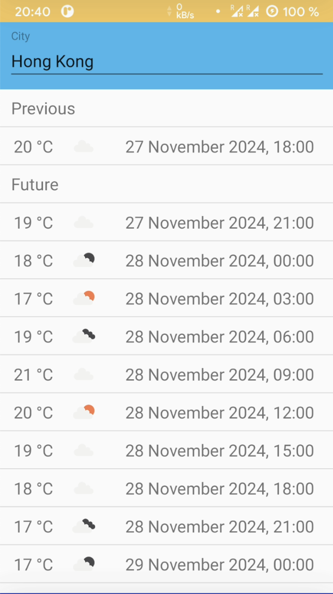

# Open Weather Forecast

Simple Android application which represents a wrapper for [OpenWeatherMap API](https://openweathermap.org/api) and developed mostly to practice with MVVM architectural pattern, LiveData and ViewModel from [Android Architecture Components](https://github.com/googlesamples/android-architecture-components) and Realm database. The application shows 5 day weather forecast for every 3 hours for the city entered in the corresponding field. Also, the application handles configuration changes and implements repository pattern storing cache data locally.



## Dependencies

* [Kotlin](https://github.com/JetBrains/kotlin) 1.3.41
* [Dagger](https://github.com/google/dagger) 2.23.2
* [Retrofit](https://github.com/square/retrofit) and [Gson Converter](https://github.com/square/retrofit/tree/master/retrofit-converters/gson) 2.6.0
* [OkHttp Logging Interceptor](https://github.com/square/okhttp/tree/master/okhttp-logging-interceptor) 4.0.0
* [RecyclerViewHelper](https://github.com/nisrulz/recyclerviewhelper) 25.4.0
* [Glide](https://github.com/bumptech/glide) 4.9.0
* [Realm](https://github.com/realm/realm-java) 5.12.0

## Building

Run [Gradle](https://github.com/gradle/gradle) from the root directory of the project to build it.

``` bash
./gradlew build
```

After completion there will be two directories in app/build/outputs/apk with apk files for debug and release.

## License

[MIT](LICENSE) © [alxiw](https://github.com/alxiw)